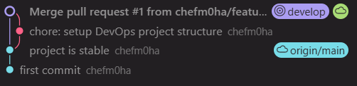
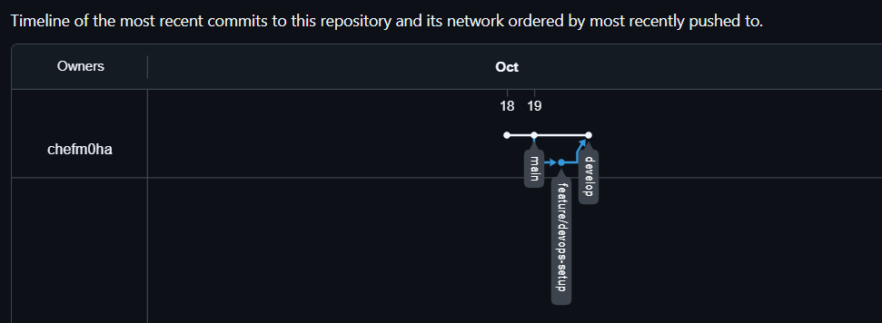
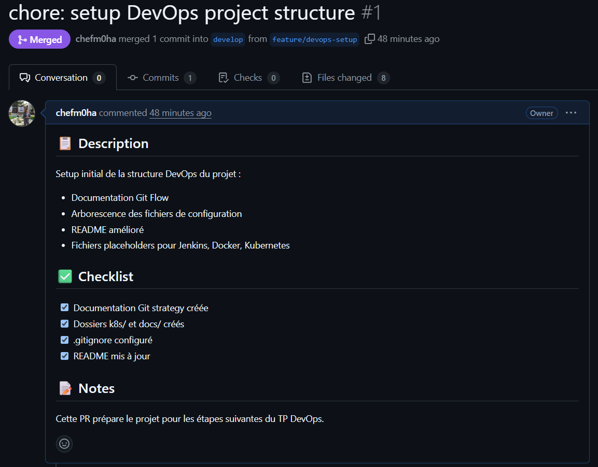

# Étape 1 : GitHub - Gestion du code source

## Convention de branches adoptée

Nous avons adopté **Git Flow** comme convention de gestion des branches.

### Justification du choix

Git Flow est particulièrement adapté pour :
- Projets avec releases régulières
- Équipes travaillant en parallèle sur plusieurs features
- Besoin de maintenir plusieurs versions en production
- Séparation claire entre développement et production

### Structure mise en place

- **main** : Code en production, toujours stable
- **develop** : Branche de développement principale
- **feature/** : Branches de fonctionnalités
- **hotfix/** : Corrections urgentes

Voir [git-strategy.md](git-strategy.md) pour plus de détails.

## Historique des commits

### Premier commit
```
chore: setup DevOps project structure
```

### Branches créées
1. `main`
2. `develop` 
3. `feature/devops-setup` 

### Screenshots





## Politique de merge

Nous utilisons deux approches selon le contexte :

### Merge commit (privilégié)
- Pour les features importantes
- Préserve l'historique complet
- Facilite le rollback si nécessaire
- Utilisé via Pull Request sur GitHub

**Avantages** :
- Historique clair de quand une feature a été intégrée
- Facilite la traçabilité

**Commande** :
```bash
git merge --no-ff feature/ma-feature
```

### Rebase (occasionnel)
- Pour nettoyer l'historique avant une PR
- Pour les features très simples

**Avantages** :
- Historique linéaire et propre
- Pas de commits de merge superflus

**Commande** :
```bash
git rebase develop
```

### Notre règle

> Toutes les intégrations dans `develop` et `main` se font via **Pull Request avec merge commit**.
> Le rebase est utilisé uniquement pour nettoyer une branche feature avant la PR.

## Workflow pratique

### Créer une nouvelle feature
```bash
git checkout develop
git pull origin develop
git checkout -b feature/nom-de-la-feature
# ... développement ...
git add .
git commit -m "feat: description"
git push -u origin feature/nom-de-la-feature
# Créer une PR sur GitHub
```

### Intégrer une feature
1. Pull Request sur GitHub
2. Review par un membre de l'équipe (si applicable)
3. Vérification du build CI (Jenkins)
4. Merge si tout est OK
5. Suppression de la branche

## Protection des branches

Configuration appliquée sur GitHub :
- `main` : Protected ✓
    - Require pull request reviews
    - Require status checks to pass
- `develop` : Protected ✓
    - Require status checks to pass


## Prochaines étapes

- [ ] Setup Jenkins pipeline
- [ ] Intégration SonarQube
- [ ] Containerisation Docker
- [ ] Déploiement Kubernetes

---

**Date de rédaction** : 1910/2025  
**Auteurs** : chefm0ha